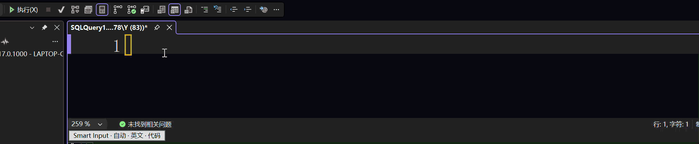

# Smart Input for Visual Studio and SSMS

作者：**我在人间做废物**

面向中文开发者的本地智能输入态切换扩展，项目名为 **Smart Input**。本项目独立实现，参考 Smart Input Pro 的交互思路，不包含其代码、资源、授权或收费系统。

**当前版本为 0.3.1。**0.3.1 在 0.3.0 的基础上进一步完善了对 **SQL Server Management Studio（SSMS）18 / 19 / 20 / 22** 各版本的兼容、部署与加载支持，并修复了若干问题：包括在**未安装 .NET SDK** 的机器上仅靠 Visual Studio / Build Tools 自带的 MSBuild 与 NuGet 还原即可完整构建（此前部分环境需要额外安装 .NET SDK 才能编译），以及 SSMS 手动部署、扩展加载与 MEF 缓存清理相关的一些问题；核心的自动中英文态切换功能与交互规则保持不变。在原 Visual Studio 扩展的基础上，0.3.0 新增了对 **Transact-SQL** 语言和 **SQL Server Management Studio（SSMS）** 的支持：在 SQL 查询编辑器里，同样按光标所在的代码、注释、字符串上下文自动切换微软拼音 / 搜狗拼音的中英文态。扩展提供选项页、左下角状态栏和暂停/恢复命令，全程本地运行，不联网、不采集源码或按键。其中 **SSMS 22 已完成首轮实机验证**：扩展可正常安装加载，T-SQL 上下文识别、状态显示，以及**搜狗拼音的中英文自动切换与手动 Shift 切换均实测正常**（详见下文“兼容性与已知限制”）。

## 项目背景与由来

在 Visual Studio 中编写代码时，中文开发者总要在中英文输入法之间反复手动切换：写代码需要英文，写注释、字符串里的中文又要切回中文。频繁的手动切换不仅打断思路、拖慢编码效率，还很容易在中英文（全角 / 半角）标点之间出错——例如把 `;`、`()`、`""` 误写成 `；`、`（）`、`“”`，从而带来不必要的编译错误和返工。

本项目由 **Di-Y**（GitHub：[Di-Y](https://github.com/Di-Y)）**提出**。正是出于这一痛点，Di-Y 希望在 Visual Studio 与 SSMS 上获得类似 JetBrains IDE 插件 **Smart Input Pro (Chinese)** 的体验：无需手动切换，由扩展按光标所在的代码、注释、字符串上下文自动判断并切换中英文态，由此提出了 Smart Input 的产品设想与功能构想。需要特别说明的是，**项目早期（0.1.x – 0.2.x）Di-Y 仅提出需求意见与功能构想，并未参与编码实现**；自 **0.3.0 起 Di-Y 才亲自承担开发与维护**，0.3.0 与 0.3.1 两个版本均由其更新开发。本项目为独立设计与实现，仅参考 Smart Input Pro (Chinese) 的交互思路，不包含对方的代码、资源、授权或收费系统。

分工与版本演进如下：

| 角色 | 说明 |
| --- | --- |
| 项目提出者（需求与功能构想）：**Di-Y** | 定义产品目标、交互规则与功能边界。0.1.x – 0.2.x 阶段仅提出意见与功能构想，**未参与前期编码** |
| 前期主要实现（0.1.x – 0.2.x）：**我在人间做废物** | 完成 Visual Studio 上 C / C++ / C# 的自动中英文态切换 |
| 0.3.0 开发与维护：**Di-Y** | 新增 Transact-SQL 语言与 SSMS 18 / 19 / 20 / 22 支持，构建现代 + Legacy 双包 |
| 0.3.1 开发与维护：**Di-Y** | 完善 SSMS 18 / 19 / 20 / 22 的兼容、手动部署与扩展加载，修复相关 bug；解决未安装 .NET SDK 时的构建问题（仅 MSBuild + NuGet 即可构建），核心交互保持不变 |
| 协同开发 / 贡献 | 见下文“协同开发与贡献”一节 |

## 功能演示




## 支持范围

| 宿主 | 位数 / Shell | 安装方式 |
| --- | --- | --- |
| Visual Studio 2022 **17.14+** / Visual Studio 2026 | x64，VSSDK 17 | 安装 `SmartInput.VisualStudio.vsix` |
| **SSMS 22（即 SSMS 2025）** | x64，基于 VS 2026 Shell | 现代包手动部署，`tools\Deploy-SSMS22.ps1` |
| **SSMS 18 / 19 / 20（即“SSMS 2022”这一代 32 位版本）** | x86，基于 VS 2017 Shell（VSSDK 15） | Legacy 包手动部署，`tools\Deploy-SSMS-Legacy.ps1` |

- 系统：Windows 10 / Windows 11；需要 .NET Framework 4.8（VS、SSMS 19/20/22 的现代安装均已满足）。
- 语言：C、C++、C# 以及 **Transact-SQL（T-SQL）** 的可编辑文档 / 查询视图。
- 输入法：当前活动的**微软拼音或搜狗拼音**。扩展只切换其内部中英文状态，不安装、添加或主动切换键盘布局，也不控制其他输入法。

> SSMS 18 及以上版本**不运行 VSIX Installer**，微软对第三方 SSMS 扩展也不提供官方安装入口。本项目按社区通行做法，把扩展文件平铺到 SSMS 的 `Common7\IDE\Extensions` 目录并清理缓存完成安装（见下文“安装与使用”）。

## 交互规则

通用规则：

| 场景 | 自动输入态 |
| --- | --- |
| 代码、字符字面量 | 英文 |
| 单行、多行、三斜线注释正文 | 中文 |
| 包含汉字的字符串文本段 | 中文 |
| 空字符串、纯英文字符串 | 英文 |
| C# 插值表达式 | 英文；表达式内部的注释/字符串单独判断 |

Transact-SQL 规则（0.3.0 新增）：

| T-SQL 场景 | 自动输入态 |
| --- | --- |
| 关键字、表名 / 列名、负数、运算符等代码 | 英文 |
| `--` 单行注释、`/* ... */` 块注释正文（块注释**支持嵌套**） | 中文 |
| 含汉字的单引号字符串 `'...'` / `N'...'`（可跨多行） | 中文 |
| 字符串内的 `''` 转义引号按同一字符串处理 | 中文 / 英文随整体内容 |
| 空字符串、纯英文字符串、仅 emoji 的字符串 | 英文 |
| `[方括号标识符]`（含 `]]` 转义），即使其中是汉字 | 英文 |
| `"双引号标识符"`：`SET QUOTED_IDENTIFIER ON`（默认）时双引号界定标识符（含 `""` 转义），即使其中是汉字 | 英文 |
| `SET QUOTED_IDENTIFIER OFF` 之后的 `"双引号字符串"`：按字符串字面量处理，含汉字推荐中文、纯英文推荐英文 | 中文 / 英文随内容 |
| 字符串内部的 `--`、`/*` 不当作注释；括号标识符内部的引号 / `--` 不当作字符串 / 注释 | 随外层区域 |

可打开仓库内的 `samples/Contexts.sql`（以及 `Contexts.cs`、`Contexts.cpp`）逐区域体验。T-SQL 没有字符字面量与字符串插值，反斜杠也不是转义符，因此单引号字符串可一直延续到闭合引号（允许跨行）。

启动时不修改系统默认输入法。第一次进入受支持编辑器时按当前场景初始化：代码为英文，注释为中文。启动页、搜索框、终端等不接管。

手动切换（包括 Shift）以**实际读到的输入态变化**为准，不拦截用户按键。搜狗输入法在普通状态写入无法确认时，仅发送一次已配置的 Shift 切换键作为兼容性恢复，并再次读取状态；微软拼音不模拟按键。偏离当前自动规则时保留手动选择并显示配置颜色光标；在同一文本区域持续输入不会立即被切回。切回推荐状态、离开该区域、切换文档或失焦后恢复自动规则。手动覆盖按文本区域而非固定秒数保持。

**不固定要求使用 Shift。** 请使用输入法设置中实际配置的中英文切换方式，例如微软拼音的 Ctrl＋空格或已启用的 Shift。如果系统没有启用 Shift，单按 Shift 不会切换，扩展也不会将它误判为手动切换。快捷键与宿主命令冲突时，以是否真正改变输入法状态为准。扩展不自动修改系统快捷键设置。

编辑器底部的 `Smart Input` 按钮显示状态；单击暂停/恢复所有文档的自动切换。在 Visual Studio 与 SSMS 22 中，暂停也可通过 `工具 > Smart Input: 暂停自动切换/恢复自动切换` 操作。**SSMS 18/19/20 的 Legacy 包不注册“工具”菜单命令**（该宿主不编译菜单资源），请使用底部状态栏按钮或选项页。暂停仅保存在当前宿主进程内，重启后恢复为未暂停。

长期设置位于 `工具 > 选项 > Smart Input > 常规`：

- 启用自动切换。
- 显示左下角状态栏。
- 手动覆盖光标颜色。
- 是否自定义状态栏文字颜色。
- 状态栏文字颜色。

安全边界：

- 组词期间不切换；有选区或多个光标时暂不切换。
- 只有本进程的编辑器获得键盘焦点时才发出切换请求。
- 每次切换后读取状态确认，600ms 未确认最多再尝试一次，仍未确认则停止当前区域内的重试。
- 搜狗输入法仅在一次状态确认失败时发送一次 Shift 恢复按键，不连续模拟，也不修改系统快捷键设置。
- 未识别出微软拼音/搜狗拼音或无法读取状态时不猜测、不操作。
- 超过 2M 字符的文件不自动分析；分析在后台进行，旧快照会取消。
- 不修改源文本，不自动替换标点；不联网、不采集源码、按键或候选词。
- 不写入“字体和颜色”或正文画刷；失焦、暂停、关闭文档时移除自定义光标装饰并恢复原生光标。

## 构建与测试

需要 MSBuild（VS 2022 17.14+ 或兼容版本）和 .NET Framework 4.8 目标包。**不需要 .NET SDK，也不需要先安装 VS 扩展开发工作负载**：编辑器引用和 VSIX 构建任务从 NuGet 项目依赖获得（VSSDK 17 与 VSSDK 15 依赖都会还原到项目 `.packages` 目录）。

```powershell
.\build.ps1
# 已还原依赖时可离线构建
.\build.ps1 -SkipRestore
# 也可显式指定 MSBuild
.\build.ps1 -MSBuildPath 'C:\Path\To\MSBuild.exe'
```

脚本只还原、构建、测试和检查打包内容，不安装扩展，不启动 VS / SSMS。一次构建产出两套互不相同的二进制（**不能互换使用**，否则会出现“包未正确加载”）：

- 现代包（x64，VSSDK 17）：`src/SmartInput.VisualStudio/bin/Release/SmartInput.VisualStudio.vsix`，用于 Visual Studio 2022/2026 与 SSMS 22。
- Legacy 包（AnyCPU，绑定 VSSDK 15.0.0.0）：`src/SmartInput.Ssms.Legacy/bin/Release/`，用于 32 位 SSMS 18/19/20。

`tools/Verify-Package.ps1` 校验现代 VSIX，`tools/Verify-LegacyPackage.ps1` 校验 Legacy 负载（文件齐全、AnyCPU、引用程序集确为 15.x、pkgdef 与 v1 清单要素完整）。

制作 GitHub Release 上传的 SSMS 安装包时，运行 `tools/Pack-Release.ps1`（先完成上面的 Release 构建），它会在 `artifacts/` 下生成两个开箱即用的压缩包：`SmartInput-SSMS22.zip`（现代 VSIX + `Deploy-SSMS22.ps1` + 安装说明）与 `SmartInput-SSMS-Legacy.zip`（Legacy 四个平铺文件 + `Deploy-SSMS-Legacy.ps1` + 安装说明）；加 `-Build` 可先自动执行一次 `build.ps1`。

## 安装与使用

### 获取发布包（普通用户无需自行构建）

从 GitHub 的 [Releases](https://github.com/Di-Y/SmartInput-for-Visual-Studio-and-SSMS/releases) 按宿主下载对应资产：

| 宿主 | 下载资产 | 安装方式 |
| --- | --- | --- |
| Visual Studio 2022 / 2026 | `SmartInput.VisualStudio.vsix` | 双击经 VSIX Installer 安装 |
| SSMS 22（2025，64 位） | `SmartInput-SSMS22.zip` | 解压后用其中的 `Deploy-SSMS22.ps1` 平铺部署 |
| SSMS 18 / 19 / 20（32 位） | `SmartInput-SSMS-Legacy.zip` | 解压后用其中的 `Deploy-SSMS-Legacy.ps1` 平铺部署 |

两个 SSMS 压缩包都已把部署脚本与所需载荷放在同一目录，解压后在该目录内运行脚本即可，脚本会自动找到同目录的 VSIX / 平铺文件，无需保留源码目录结构。正式部署前可先加 `-WhatIf` 只读演练（不改动系统，也不要求管理员权限或关闭 SSMS）；脚本删除 SSMS 私有注册表缓存前，会先自动备份到缓存目录下的 `SmartInput-PrivateRegistry-Backup` 子目录。

### Visual Studio 2022 / 2026

双击安装 `src/SmartInput.VisualStudio/bin/Release/SmartInput.VisualStudio.vsix`，重启 Visual Studio。

### SSMS 22（SSMS 2025，64 位）

先完全关闭 SSMS，然后用**“以管理员身份运行”**的 PowerShell 执行：

```powershell
# 从源码构建部署；若从 Release 的 SmartInput-SSMS22.zip 解压，则在解压目录运行 .\Deploy-SSMS22.ps1
powershell -ExecutionPolicy Bypass -File .\tools\Deploy-SSMS22.ps1
# 正式执行前可先只读演练（不改动系统，也无需管理员权限或关闭 SSMS）
powershell -ExecutionPolicy Bypass -File .\tools\Deploy-SSMS22.ps1 -WhatIf
# 卸载
powershell -ExecutionPolicy Bypass -File .\tools\Deploy-SSMS22.ps1 -Uninstall
```

脚本会把现代 VSIX（本质是 zip）解压、平铺为 SSMS 22 需要的文件到
`C:\Program Files\Microsoft SQL Server Management Studio\22\Release\Common7\IDE\Extensions\SmartInput\`，
删除 `%LocalAppData%\Microsoft\SSMS\22.0_*\` 下的 `privateregistry.bin`（含 `.LOG1/.LOG2`）与 `ComponentModelCache`，并写入 `extensions.configurationchanged` 标记。删除 `privateregistry.bin` 前会先把它自动备份到该缓存目录下的 `SmartInput-PrivateRegistry-Backup` 子目录（文件名带时间戳），需要时可用于恢复 Shell 布局。

实机部署补充（SSMS 22，已在 22.10 上验证）：

- 即使 SSMS 安装在非系统盘（如自定义的 `D:\...`），其 `Common7\IDE\Extensions` 目录仍需管理员权限写入，请始终用“以管理员身份运行”的 PowerShell 执行脚本。
- 脚本默认只自动探测 `C:\Program Files\...` 下的标准安装路径；若 SSMS 安装在自定义目录，请显式传入 IDE 目录，例如：

```powershell
powershell -ExecutionPolicy Bypass -File .\tools\Deploy-SSMS22.ps1 -SsmsIdeDir 'D:\SQL Server Studio 22\Common7\IDE'
```

- 部署会清理 SSMS 的私有注册表与 MEF 缓存，首次重启可能需要重新确认一次界面布局；使用本地“Windows 身份验证”连接数据库引擎不需要任何 Microsoft / Azure 账号登录。

### SSMS 18 / 19 / 20（SSMS 2022 代，32 位）

先完全关闭 SSMS，然后用**“以管理员身份运行”**的 PowerShell 执行：

```powershell
# 部署到本机检测到的所有 18/19/20 版本
# 从源码构建用 .\tools\Deploy-SSMS-Legacy.ps1；从 Release 的 SmartInput-SSMS-Legacy.zip 解压则运行 .\Deploy-SSMS-Legacy.ps1
powershell -ExecutionPolicy Bypass -File .\tools\Deploy-SSMS-Legacy.ps1
# 只装某一版（18 / 19 / 20）
powershell -ExecutionPolicy Bypass -File .\tools\Deploy-SSMS-Legacy.ps1 -Version 20
# 正式执行前可先只读演练（不改动系统，也无需管理员权限或关闭 SSMS）
powershell -ExecutionPolicy Bypass -File .\tools\Deploy-SSMS-Legacy.ps1 -WhatIf
# 卸载
powershell -ExecutionPolicy Bypass -File .\tools\Deploy-SSMS-Legacy.ps1 -Uninstall
```

脚本把 Legacy 负载平铺到
`C:\Program Files (x86)\Microsoft SQL Server Management Studio {18|19|20}\Common7\IDE\Extensions\SmartInput\`，
并清理 `%LocalAppData%\Microsoft\SQL Server Management Studio\{版本}.0_IsoShell\` 下的私有注册表与 MEF 缓存。SSMS 只扫描 Program Files 下的全局扩展目录，不扫描当前用户目录。从 Release 的 `SmartInput-SSMS-Legacy.zip` 安装时，脚本与四个载荷文件在同一解压目录，把命令中的脚本路径改为 `.\Deploy-SSMS-Legacy.ps1` 即可；删除私有注册表前同样会先自动备份到 `SmartInput-PrivateRegistry-Backup`。

### 安装后检查

- `工具 > 选项 > Smart Input > 常规` 是否存在。
- Visual Studio / SSMS 22 的 `工具` 菜单中是否存在 Smart Input 暂停命令（SSMS 18-20 无此菜单，属预期）。
- 打开 C/C++、C# 或 `.sql` 文件后，编辑器底部是否出现 `Smart Input` 状态按钮。
- 在 `.sql` 窗口中，左下角状态条随光标位置变化：代码与 `[标识符]` / `"标识符"` 区域显示“英文 · 代码”，`--`、`/* */` 注释与含汉字字符串显示“中文 · 注释 / 字符串”。在 SSMS 22 + 搜狗拼音下实测，移动光标即会自动切换到对应中 / 英文态，手动按 Shift 也可正常切换，与推荐态不符时输入光标变为提示色。

若扩展未出现，请确认部署前 SSMS 已完全关闭、缓存文件确实被删除；也可用 `Ssms.exe -log` 启动并在 `%AppData%\Microsoft\SSMS\<版本>\ActivityLog.xml` 中检索错误。从浏览器下载的压缩包解压后如遇“已阻止加载网络位置程序集”，对扩展目录执行 `Get-ChildItem <扩展目录> -Recurse | Unblock-File`（部署脚本已自动处理）。

## 代码结构

- `src/SmartInput.Core`：无外部依赖的词法边界分析与手动覆盖状态机。`ContextAnalysis.cs` 内按语言分流，T-SQL 扫描规则与 C/C++、C# 并列。
- `src/SmartInput.VisualStudio`：现代包（VSSDK 17，x64）。MEF 编辑器接入、选项页、工具菜单命令、后台快照分析、微软拼音/搜狗拼音状态读写、临时光标颜色、状态栏按钮；同时目标 Visual Studio 与 SSMS 22。
- `src/SmartInput.Ssms.Legacy`：SSMS 18/19/20 的 32 位包（VSSDK 15，net48，AnyCPU）。用 `<Compile Link>` 共享 `SmartInput.VisualStudio` 的全部源码，仅引用 VSSDK 15 程序集；`SmartInput.VisualStudio.pkgdef` 与 v1 `extension.vsixmanifest` 为手写维护。
- `tests/SmartInput.Tests`：可直接运行的控制台测试程序，失败返回非零退出码。
- `samples/Contexts.sql`、`Contexts.cs`、`Contexts.cpp`：编辑器交互检查样例（不参与构建）。
- `tools/Deploy-SSMS22.ps1` / `tools/Deploy-SSMS-Legacy.ps1`：SSMS 手动部署 / 卸载与缓存清理；支持 `-WhatIf` 只读演练，删除私有注册表前自动备份。
- `tools/Pack-Release.ps1`：构建后收集产物，生成供 GitHub Release 上传的 `SmartInput-SSMS22.zip` 与 `SmartInput-SSMS-Legacy.zip`。
- `tools/Verify-Package.ps1` / `tools/Verify-LegacyPackage.ps1`：分别校验现代 VSIX 与 Legacy 负载，不加载或安装扩展。
- `docs/MANUAL-TESTS.md`：安装前提、实机验证步骤和回归项目。
- `docs/VALIDATION.md`：验证结果、兼容性和已知边界。
- `docs/RELEASE-NOTES.md`：发布说明和版本变化。
- `docs/PRIVACY.md`：本地处理与隐私边界说明。
- `tools/Inspect-Pinyin.ps1`、`tools/Inspect-InputMethods.ps1`：Windows PowerShell 5.1 下的只读检查，不执行输入态切换。
- `docs/CARET-FIX.md`：手动覆盖光标装饰层的技术原因、实现方式和验证边界。

后台词法扫描器负责引号、注释和插值的边界分析，VS 语法分类辅助排除非活动代码；它不是完整编译器。T-SQL 部分覆盖注释、单引号字符串、括号标识符与双引号定界内容的常见写法；双引号按文本中出现的 `SET QUOTED_IDENTIFIER ON/OFF` 顺序判定（默认 ON：双引号为标识符；OFF：双引号为字符串）。由于 `QUOTED_IDENTIFIER` 本质是连接 / 批处理 / 运行时设置，存储过程、触发器内或跨 `GO` 批处理中由运行时决定、静态文本无法确定的取值，仍按默认 ON 处理；非常见的宿主专有语法也可能存在识别偏差。分类信息尚未更新时，可能暂时按词法结果判断。

## 兼容性与已知限制

截至 0.3.1，**143 项自动化测试全部通过**（0.3.0 在 0.2.1 的 104 项基础上新增 34 项 T-SQL 用例；0.3.1 评审修订再补 5 项 `SET QUOTED_IDENTIFIER ON/OFF` 用例），包含三语言随机文本边界安全、Profile 匹配、23 项光标绘制与生命周期检查，以及离屏 WPF 渲染的颜色像素检查。现代 VSIX 与 Legacy 负载的结构、目标版本、依赖隔离、AnyCPU / VSSDK 15 绑定均通过脚本校验。

需要如实说明的验证边界：

- 构建与自动化测试、双包结构校验在本机完成。**SSMS 22 已完成首轮实机验证**（环境：Windows 11、SSMS 22.10.12210.168 / x64、本地 SQL Server、Windows 身份验证、搜狗拼音）：管理员部署脚本可把 6 个文件平铺到 `Common7\IDE\Extensions\SmartInput` 并清理私有注册表 / MEF 缓存；重启后扩展被 MEF 成功加载（`Ssms.exe -log` 的 `ActivityLog.xml` 记录了 `.pkgdef` 扫描），`工具` 菜单出现 `Smart Input: 暂停/恢复自动切换` 命令；打开 `.sql` 查询后左下角出现 `Smart Input` 状态条，并随光标位置正确显示区域与目标输入态——普通代码 / 空行为“自动 · 英文 · 代码”，`/* … */` 块注释为“自动 · 中文 · 注释”；有选区时显示“选区中，暂不切换”，手动按 Shift 进入“手动覆盖”、与推荐态不符时输入光标变为配置的提示色，移动到其它区域后自动恢复自动模式；**用物理键盘实测，鼠标在代码区与注释区（及含汉字字符串）之间移动时，搜狗拼音会自动切换到对应中 / 英文态（代码区直接上屏英文、注释区可输入中文），手动按 Shift 切换同样正常**；连接、编辑与反复移动光标全程无崩溃或挂起。
- **SSMS 22 + 搜狗拼音的自动切换已实测通过。** 用物理键盘在代码区与注释区（及含汉字字符串）之间移动光标，搜狗拼音即随上下文自动在英文 / 中文间切换：代码区直接上屏英文，注释区可输入中文，无需额外按键；手动按 Shift 的手动覆盖、与推荐态不符时的提示色光标、移动到其它区域后自动恢复等行为也均正常，未出现“状态条正确但输入法不跟随”的情况。
- **微软拼音在 SSMS 22 下尚未单独做同项实机验证**（本轮活动输入法为搜狗拼音）。微软拼音走 WPF 原生 TSF 状态通道、不模拟按键；鉴于第三方 TSF 的搜狗拼音已实测可正常自动 / 手动切换，微软拼音预期同样可用，但在取得实测结论前仍欢迎通过 Issue 反馈结果。
- **SSMS 18 / 19 / 20（32 位 Legacy 包）本机未安装，仍未经实机验证**：其实际加载、T-SQL 编辑器 ContentType 的运行时名称与输入法切换表现，需在装有对应版本的机器上按 `docs/MANUAL-TESTS.md` 确认。为降低风险，SQL 编辑器同时以精确的 `SQL` ContentType 和运行时按类型名兜底（类型名含 SQL 但非 `SQL` 派生时也接管）两种方式接入。
- Visual Studio 上的 C/C++、C# 行为延续 0.2.1；新增的 T-SQL 路径在 Visual Studio 的 SQL 编辑器中同样建议实测。
- SSMS 18/19/20 的 Legacy 包不提供“工具”菜单暂停命令（该宿主不编译菜单资源），暂停 / 恢复请用状态栏按钮。
- 搜狗拼音的 Shift 兜底在 32 位与 64 位进程中的 Win32 结构体布局沿用既有实现；该兜底在 Visual Studio 与 SSMS 22（WPF 编辑器）中均已实测，自动切换与手动 Shift 切换表现正常。

Windows 的输入态可能受“每个应用窗口使用不同输入法”等系统选项影响。本扩展限制自己的调用范围，但不能仅凭这一点保证切出宿主后系统完全不会继承原输入态。

以下范围不属于当前支持承诺：

- SSMS 22 的 ARM64 原生扩展（当前为 amd64 目标，可在 x64 / x64 仿真环境使用）。
- 微软拼音旧版兼容模式。
- C++ 预处理器复杂分支/拼接、C# 插值格式段、T-SQL 宿主专有方言和不完整语法的全部边界。

## 协同开发与贡献

感谢项目提出者与各位协作者参与 Smart Input 的开发与维护（具体贡献以 Git 提交记录与发布说明为准）：

- **Di-Y**（GitHub：[Di-Y](https://github.com/Di-Y)）—— **项目提出者，0.3.0 / 0.3.1 开发者与维护者**。Di-Y 提出了 Smart Input 的产品目标、交互规则与功能构想；在 0.1.x – 0.2.x 阶段仅提供需求意见与功能构想、未参与编码，自 0.3.0 起亲自承担开发与维护，涵盖 Transact-SQL 语言与 SSMS 多版本（18 / 19 / 20 / 22）适配、Visual Studio 与 SSMS 双包（VSSDK 17 / VSSDK 15）工程结构、SSMS 各版本手动部署与扩展加载相关问题的修复，以及在未安装 .NET SDK 环境下构建与打包流程的工程化（仅 MSBuild + NuGet 还原即可构建），并完善文档、部署脚本、样例与自动化测试用例。

欢迎更多开发者参与协同开发，推荐流程如下：

1. 在 GitHub 上通过 Issue 反馈缺陷或提出功能建议，并附上系统版本、Visual Studio / SSMS 版本、扩展版本、输入法版本、复现步骤与实际表现（请勿上传私人源码、候选词或完整按键记录）。
2. Fork 仓库后在独立分支修改，通过 Pull Request 提交，并在描述中说明动机、改动点与验证方式。
3. 改动请遵循“只解决目标问题、不改变既有交互语义”的原则；提交前在仓库根目录运行 `.\build.ps1`，确保 **143 项自动化测试**与 `tools\Verify-Package.ps1`、`tools\Verify-LegacyPackage.ps1` 双包校验全部通过。
4. 不要提交 `.packages`、`bin`、`obj`、`.vs` 等 NuGet 还原或构建产物；新增第三方依赖时须注明来源与许可证。
5. 始终遵守本项目的本地与隐私边界：不联网、不采集源码或按键、不自动替换标点（详见 `docs/PRIVACY.md`）。

> 协作者的具体贡献以 Git 提交记录与发布说明（`docs/RELEASE-NOTES.md`）为准；如署名或贡献描述需要调整，欢迎通过 Issue 或 Pull Request 更正。

## 许可证

作者：**我在人间做废物**。

本项目采用 [MIT License](LICENSE)。除许可证文本中规定的条件外，使用、修改、分发本项目不附加额外限制。项目依赖遵循各自许可证，不代表本项目许可证覆盖第三方代码、商标或资源。

提交代码或文档时，请确保提交内容由提交者拥有相应权利，或已取得必要授权；新增第三方依赖时，请同时说明其来源和许可证。

问题反馈请提供系统版本、Visual Studio / SSMS 版本、扩展版本、输入法版本、操作步骤和实际表现。提交问题时请避免上传私人源码、候选词或完整按键记录。

参考：[SSMS 版本与扩展兼容说明](https://learn.microsoft.com/sql/ssms/sql-server-management-studio-changelog-ssms)、[VS 2026 扩展兼容模型](https://learn.microsoft.com/zh-cn/visualstudio/extensibility/migration/extension-compatibility?view=visualstudio)、[VS 光标格式接口](https://learn.microsoft.com/en-us/visualstudio/extensibility/walkthrough-customizing-the-text-view?view=vs-2022)、[WPF InputMethod](https://learn.microsoft.com/en-us/dotnet/api/system.windows.input.inputmethod?view=netframework-4.8)。SSMS 手动部署与缓存清理的实现参考了开源项目 [mourier/sql-pilot](https://github.com/mourier/sql-pilot) 的集成笔记。
